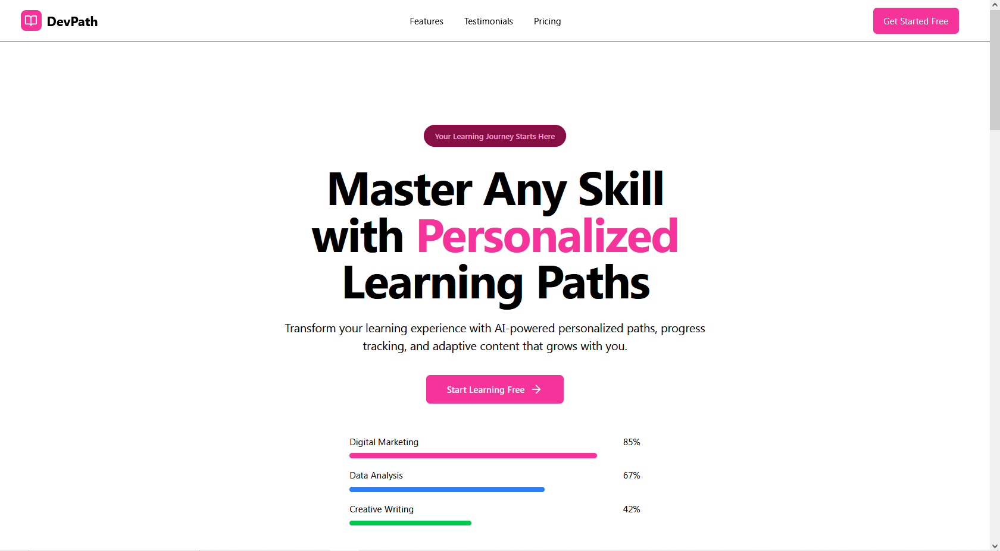
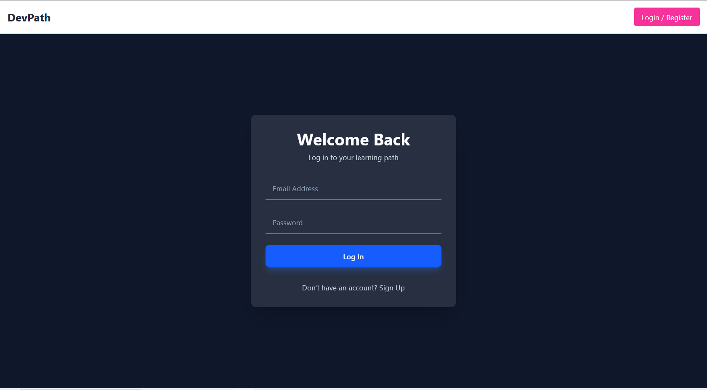
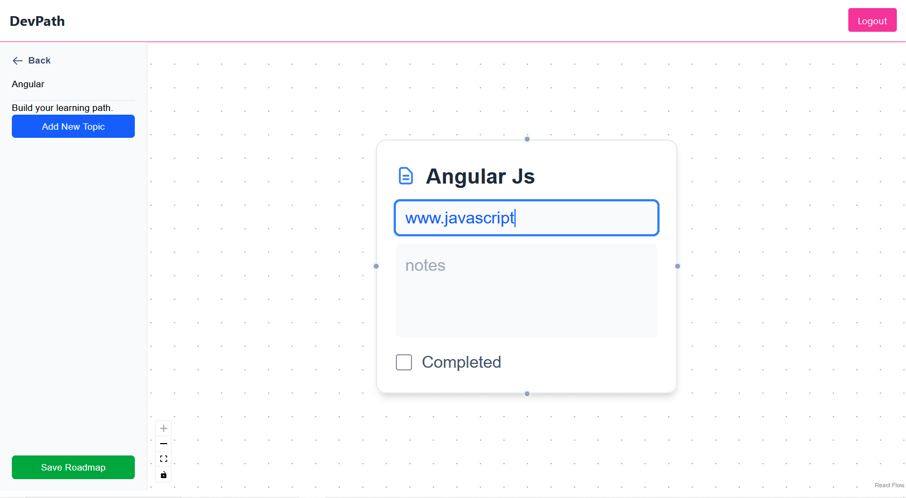
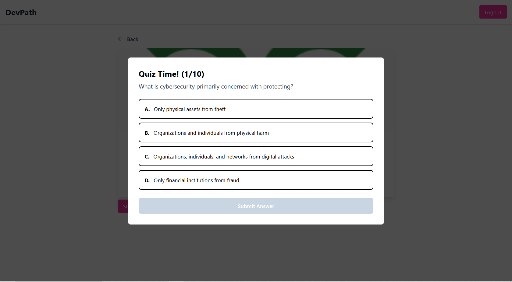

DevPath: Personalized Learning Path Navigator 

A full-stack MERN application that allows users to create, visualize, and track their progress on custom learning roadmaps, featuring an interactive node-based editor and AI-powered quiz generation.

Key Features

    Secure User Authentication: Full login/signup functionality using JWT for secure, stateless authentication and protected backend routes.

    Interactive Roadmap Editor: A dynamic, graph-based UI built with React Flow that allows users to:

        Create, edit, and delete content nodes.

        Form connections between nodes with multiple handles.

        Pan, zoom, and fit the entire roadmap to the view.

    Smart Content Nodes: Paste a URL and the backend automatically scrapes metadata using Cheerio, detecting the content type (article, image, video) and fetching relevant thumbnails and summaries to create rich content previews.

    AI-Powered Quizzes: With a single click, generate a custom multiple-choice quiz for any learning path. The backend constructs a detailed prompt from the path's content and uses the Google Gemini API to create relevant questions.

    Progress Tracking: Mark individual nodes as complete and see your overall path progress updated in real-time on the dashboard, with calculations automated by Mongoose middleware on the backend.

    Modern Frontend: Built with React and styled with Tailwind CSS, featuring a themed, animated authentication page and a central AuthContext for global state management.

Live Demo & Visuals

(Since the project is not deployed, replace this section with GIFs of your application in action. This is the most important part!)

Login & Dashboard

	
Roadmap Editor

AI Quiz Generation

		

Tech Stack

Area	Technologies
Frontend	React, React Router, React Flow, Tailwind CSS, Framer Motion, Axios, jwt-decode, react-toastify
Backend	Node.js, Express, MongoDB, Mongoose, JWT, bcrypt, Cors, Cheerio, @google/generative-ai
Database	MongoDB Atlas

Getting Started

To get a local copy up and running, follow these simple steps.

Prerequisites

    Node.js (v18 or later)

    npm or yarn

    A MongoDB Atlas connection string or a local MongoDB instance

Installation & Setup

    Clone the repository:

    using git clone (repo link)

Setup the Backend:

    Navigate to the backend folder: cd backend

    Install NPM packages: npm install

    Create a .env file in the backend root and add your variables:
    Code snippet

    MONGO_URI=your_mongodb_connection_string
    JWT_SECRET=your_jwt_secret
    JWT_LIFETIME=30d
    GEMINI_API_KEY=your_google_ai_studio_api_key

    Start the server: npm start
    The backend will be running on http://localhost:3000.

Setup the Frontend:

    From the root directory, navigate to the frontend folder: cd ../frontend

    Install NPM packages: npm install

    Create a .env file in the frontend root for the API URL:
    Code snippet

        REACT_APP_API_URL=http://localhost:3000

        Start the React app: npm start
        The frontend will be running on http://localhost:3001 (or another port).

📚 API Endpoints

A brief overview of the core API routes available. All /api/paths and /api/nodes routes are protected.
Method	             Endpoint	                               Description
POST	         /api/auth/register	                Register a new user.
POST	         /api/auth/login	                Login an existing user and get a JWT.
POST	         /api/paths	                      Create a new learning path with its nodes/edges.
GET	             /api/paths	                        Get all paths for the logged-in user.
GET	             /api/paths/:id	                    Get a single path with its nodes/edges.
PATCH	         /api/update/:nodeId	            Update a node (e.g., mark as complete).
POST	         /api/paths/:pathId/generate-quiz	Generate a quiz for a specific path.

🌟 Future Improvements

    Allow users to share their roadmaps with a public link.

    Implement team-based collaboration on a single roadmap.

    Add more AI features, such as automatic content summarization.

    Quiz with Face Cam for more like mock for online assessments.

